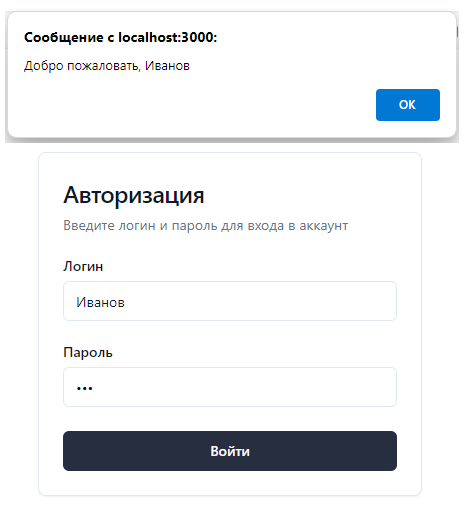

## Проект Домашнее задание по React. Форма Авторизации

**Задача**
1) Создать проект с create-react-app;
2) Расширить конфиги webpack добавив проксирование вызова АПИ;
3) Написать компонент с формой авторизации отправляющий запрос.

**Использование**

1) Скачать проект  
	```
	git clone https://github.com/m1skipper/reactAuthorizeForm.git
 	```
3) Собрать и запустить проект клиента  
Из папки проекта homework-authorize-client запустить:  
	```
	yarn install
	yarn start
 	```
4) Собрать и запустить сервер  
Из папки проекта homework-authorize-server запустить:  
	```
 	dotnet build
	dotnet run
 	```
5) В открывшемся браузере в окне логина ввести любой логин и пароль. Нажать кнопку "Войти". Должно появится сообщение "Добро пожаловать, {Логин}".  


**Реализация**

1) Создаем проект через yarn, потому что create-react-app не работает с текущей 19 версией
    + Устанавливаем yarn      
        ``` npm install -g yarn ```   
    + Создаем проект homework-authorize-client     
        ``` yarn create react-app homework-authorize-client --template typescript ```   
    + Удаляем лишние файлы из проекта
2) Форму ввода будем делать на **shadecn** компонентах https://ui.shadcn.com/  
(приняли решение делать общий проект на них)  
Как настроить компоненты написано здесь https://ui.shadcn.com/docs/installation/manual  
	+ Добавляем файлы конфигурация из папки **shadecn-config** в проект
 	+ В tsconfig.json для поддержки путей @ добавляем строку  
		``` "extends": "./tsconfig.paths.json" ```
	+ Добавляем библиотеку компонентов tailwindcss  
	  	``` yarn add tailwindcss ```
   	+ Добавляем дополнительные классы tailwindcss  
		``` yarn add tailwindcss-animate class-variance-authority clsx tailwind-merge lucide-react ```
   	+ Копируем **src/styles/global.css** в **index.css**
   	+ Добавляем компоненты
		```
   	  	npx shadcn@latest add button
   		npx shadcn@latest add card
   		npx shadcn@latest add input
   		npx shadcn@latest add label
   		```
3) Делаем eject конфигураций WebPack для того чтобы добавить proxy и поддержку путей @ для shadecn
	+ Делаем git commit иначе не даст сделать eject  
		```
  		git add *
		git commit -m "feat: homework"
  		```
	+ Делаем eject конфигурации  
		``` npm eject ```
4) Чтобы заработали пути к компонентам shadecn **@/components/ui/*** в файл **config\webpack.config.js** добавляем:
	```js
    	alias: {
	        '@': path.resolve(__dirname, '..', 'src')
	```
5) Добавляем проксирование запросов
	+ Устанавливаем пакет  
		``` yarn add http-proxy-middleware ```
	+ Создаем файл **src/setupProxy.js**, конфигурируем его чтобы ссылался на порт **8080**
6) Добавляем форму логина **src\LoginForm.tsx**
7) Добавляем поддержку axios:  
	``` yarn add axios ```  
	код авторизации  
	```js
	await axios.post("/api/Login", {}, {
	    auth: {
	        username: encodeURIComponent(formData.login),
	        password: encodeURIComponent(formData.password)
	    }
	});
	```
8) Создаем простой проект asp .net core 8.0 server **homework-authorize-server** с единственным post контроллером **/api/Login**
9) Конфигурируем его для запуска на порту **8080** **Properties\launchSettings.json**
12) Строим и запускаем .Net Api сервер
13) Запускаем клиент  
	``` npm start ```
14) При авторизации, если севере запущени и прокси работает выводится **alert("Добро пожаловать, {Логин}")**

